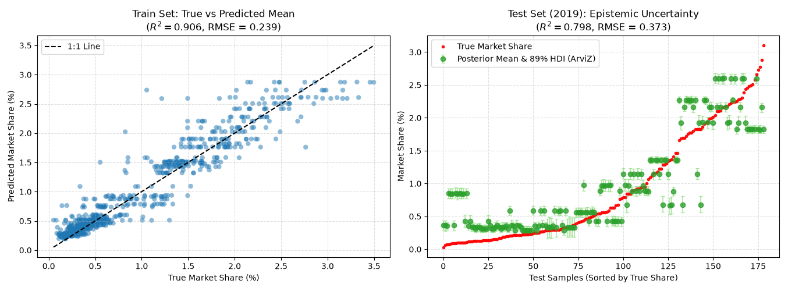

# Bayesian Deep Learning for New Product Demand Forecasting

This repository implements a **Bayesian Deep Learning (BDL)** pipeline in JAX and Equinox to forecast new automotive product market demand while providing calibrated epistemic uncertainty bounds. Designed specifically for tabular market data subject to temporal drift, the model leverages a **Last-Layer Laplace Approximation (LL-Laplace)** to combine deep feature extraction with robust Bayesian inference.

---

### **Key Features & Methodology**

* **Architecture & Framework:** Built with `Equinox` and `JAX`, utilizing explicit functional partitioning and JIT compilation. The network uses a 2-hidden-layer LeakyReLU MLP ($\text{width}=32$) with weight decay regularization (`optax.adamw`).
* **Temporal Drift Mitigation:** Numeric features are scaled relative to annual market averages prior to min-max normalization:
  $$X_{i,t}^{\text{scaled}} = \frac{X_{i,t}}{\bar{X}_t}$$
  This keeps multi-year features on a shared relative manifold across changing market conditions.
* **Last-Layer Laplace (LL-Laplace):** Instead of sampling across dense weight spaces—which causes predictive drift in deep non-linear networks—the model freezes MAP hidden representations ($\mathbf{\Phi}$) and analytically evaluates the closed-form posterior over the output layer.

 

$$\mathbf{\Sigma}_{\text{last}} = \left( \frac{\mathbf{\Phi}^T \mathbf{\Phi}}{\sigma_{\text{obs}}^2} + \lambda \mathbf{I} \right)^{-1}$$
* **Uncertainty Quantification:** Computes closed-form epistemic variance and exports 89% High-Density Intervals (HDI) formatted for `ArviZ`:
  $$\sigma_{\text{epistemic}}^2(x) = \boldsymbol{\phi}(x)^T \mathbf{\Sigma}_{\text{last}} \boldsymbol{\phi}(x)$$
* **Model Interpretability:**
  * **Gradient Sensitivity Analysis:** Quantifies global feature importance via expected absolute gradients:
    $$\text{Importance}(x_j) = \mathbb{E} \left[ \left| \frac{\partial \hat{y}}{\partial x_j} \right| \right]$$
  * **Partial Dependence Plots (PDPs):** Maps marginal feature effects across the market spectrum with shaded 90% Bayesian confidence bands.

---
### **Dataset & Features**

The model is evaluated on a historical dataset covering the small SUV segment in the Brazilian automotive market from March 2013 to December 2019:

* **Scope & Volume:** 942 monthly observations across 22 distinct small SUV models sourced from the National Federation of Vehicle Distributors (FENABRAVE).
* **Target Variable:** Monthly market share, chosen to eliminate seasonal overall market volume fluctuations.
* **Product Features:** 16 attributes normalized on a 1–5 Likert scale ($x_j \in \{1, 2, 3, 4, 5\}$), combining quantitative specs and subjective consumer/expert assessments (*Quatro Rodas*, *UOL Carros*, Weber 2009):
  * **Performance & Safety:** Price, fuel economy, performance, agility, safety.
  * **Comfort & Equipment:** Style, space, trunk volume, comfort, convenience, interior finish, equipment, infotainment.
  * **Dynamic & Perceptual:** Brand strength, robustness, and novelty (decaying by 1 point per year post-launch).

---

### **Performance Metrics**

Evaluated on an out-of-time test split (Training: $t \le 2018$, Test: $t = 2019$):

| Dataset | $R^2$ Score | RMSE | MAE |
| :--- | :--- | :--- | :--- |
| **Train ($t \le 2018$)** | **0.906** | **0.239** | **0.158** |
| **Test ($t = 2019$)** | **0.798** | **0.373** | **0.280** |

---

### **Tech Stack**

* **Core ML:** `jax`, `equinox`, `optax`
* **Bayesian Diagnostics & Stats:** `arviz`, `scikit-learn`
* **Data & Visualization:** `pandas`, `numpy`, `matplotlib`

---

### **Feature Sensitivity Analysis**

Gradient-based sensitivity analysis ($\mathbb{E} \left[ \left| \frac{\partial \hat{y}}{\partial x_j} \right| \right]$) evaluates the global influence of each product attribute on predicted market share.

#### **Key Driver Rankings**

| Rank | Feature | Importance ($\%$) | Mean Absolute Gradient |
| :---: | :--- | :---: | :---: |
| 1 | **Infotainment** | $9.81\%$ | $0.1979$ |
| 2 | **Safety** | $8.93\%$ | $0.1802$ |
| 3 | **Comfort** | $8.64\%$ | $0.1744$ |
| 4 | **Space** | $8.51\%$ | $0.1716$ |
| 5 | **Features** | $7.65\%$ | $0.1543$ |
| 6 | **Novelty** | $6.68\%$ | $0.1348$ |
| 7 | **Price** | $6.41\%$ | $0.1293$ |
| 8 | **Style** | $6.30\%$ | $0.1270$ |
| 9 | **Trunk** | $5.96\%$ | $0.1203$ |
| 10 | **Ruggedness** | $5.65\%$ | $0.1140$ |

---

#### **Managerial Insights**

* **Dominance of In-Cabin Experience & Safety:** The top four drivers—**Infotainment ($9.81\%$)**, **Safety ($8.93\%$)**, **Comfort ($8.64\%$)**, and **Space ($8.51\%$)**—collectively account for over $35\%$ of total market share variance. This indicates that small SUV buyers in Brazil prioritize tech integration, safety features, and interior ergonomics over basic utility.
* **Secondary Role of Direct Pricing:** **Price ($6.41\%$)** ranks 7th in overall importance. While price remains a baseline constraint, purchasing decisions in this segment are driven predominantly by perceived feature density and product value rather than low cost alone.
* **Lifecycle & Refresh Strategy:** **Novelty ($6.68\%$)** and overall **Features ($7.65\%$)** outperform physical styling ($6.30\%$) and trunk capacity ($5.96\%$), suggesting that tech refreshes and trim upgrades are highly effective for sustaining market share over a vehicle's life cycle.

---

### **Outputs Generated**

1. `performance_and_uncertainty.png`: Actual vs. predicted market share and out-of-sample HDI uncertainty error bars.
2. `partial_dependence_plots.png`: Marginal effect curves for top product drivers bounded by epistemic uncertainty.
